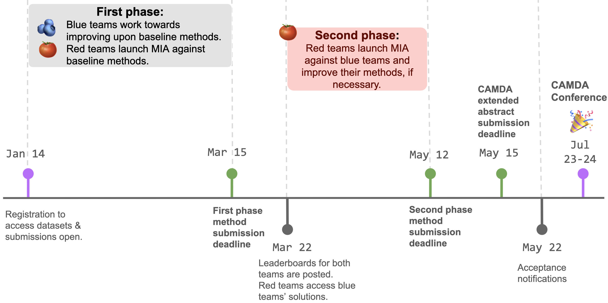

# CAMDA 2025 - ELSA Health Privacy Challenge

This repository is a "starter package" for the [Health Privacy Competition](https://benchmarks.elsa-ai.eu/?ch=4&com=introduction) that runs within [CAMDA 2025](). The  Health Privacy Challenge is organized in the context of the European Lighthouse on Safe and Secure AI (ELSA, https://elsa-ai.eu). 

The Health Privacy Competition  will run in a “Blue Team (🫐)  vs Red Team (🍅)” scheme. 
-  The **blue teams** will develop **novel privacy preserving generative methods** that can mitigate privacy risks while preserving biological insights for gene expression datasets,
- The **red teams** will launch **trustworthy and realistic membership inference attacks (MIA)** against blue teams’ solutions to assess whether these generative methods can withstand privacy attacks. 

We are looking forward to engaging with you and working together to deepen our understanding of privacy in healthcare. :hugs: 

## Introduction  

**This repository contains:**

- :woman_technologist: **Baseline code** for generative methods (**Blue Teams**) and  Membership Inference Attack algorithms  (**Red teams**).
- :memo: **Documentation** that details setup and submission instructions for the competition. 
- :paperclip: **Submission templates** to base your submissions on. 

**Other resources:**

- :speech_balloon: **[CAMDA Health Privacy Challenge Google Groups:](https://groups.google.com/g/camda-health-privacy-challenge)** Join us for questions, discussions and further announcements. 
- :globe_with_meridians: **[CAMDA Challenge website:]()** Follow CAMDA 2025 for conference announcements. 
- :globe_with_meridians: **[ELSA Benchmark method submission platform:](https://benchmarks.elsa-ai.eu/?ch=4)** The platform to register, to download datasets, and to submit your benchmark methods. 
- :books: **Relevant papers:** https://arxiv.org/abs/2402.04912 

## :roller_coaster: Get started!  

Both teams, please check out [Getting Started](/experiments/) to set up and use the starter package!

## Datasets 

We re-distribute two open access TCGA RNA-seq datasets, which can be accessed from the [GDC portal](https://gdc.cancer.gov), in the pre-processed form:

- TCGA-BRCA RNASeq 

    **Dimensions:** <1089 x 978> <individuals x landmark genes>
    **Details:** 5 subtypes

- TCGA COMBINED RNASeq (with 10 different tissues )

    **Dimensions:** <4323 x 978> <individuals x landmark genes>
    **Details:** Cancer tissue of origin prediction (10 tissues)

You can download the pre-processed datasets from [ELSA Benchmarks Competition platform](https://benchmarks.elsa-ai.eu/?ch=4&com=introduction) after registration. 

Navigate [here](/data/) for details about the pre-processing steps. 

<!-- comment 
## :chart_with_upwards_trend: Evaluation

The teams with the best solutions will be determined based on multiple criteria, including,

- :dart: leaderboard ranking, 
- :bulb: novelty of methods, 
- :seedling: generation of novel privacy preservation insights for biology. 

We strongly encourage the participants to submit their CAMDA extended abstracts for evaluation **even if they might not have high rankings on the leaderboards.** 

The winners will be  invited to present their methods at the CAMDA Conference at ISMB 2025 in Liverpool. Travel fellowships will be available for the selected teams sponsored by ELSA (https://elsa-ai.eu). 
-->

##  :date: Schedule 

<!-- 
**:round_pushpin: January 13: Submissions open.** 
- Both teams, please first register through ELSA Benchmarks Platform to download the datasets. We recommend you to register using an organizational email if possible. 
- To be considered as successfully participating in the competition:
    - Both teams must submit a CAMDA extended abstract.
    - Blue teams must have one benchmark method submission by the first phase deadline. 
    - Red teams must have two benchmark method submissions by the first and second phase deadlines, respectively. 

Red teams must have two benchmark method submissions by the first and second phase deadlines, respectively. 
- Please make sure to adhere to the guideline closely to avoid invalidating your submission.

**:round_pushpin: March 15: First phase deadline, method submission for both teams.**
- **Blue teams** must complete their first and final benchmark method submission as detailed in the [🫐 Blue Team homepage](/experiments/blue_team/README.md). 
- **Red teams** must complete their first benchmark method submissions as detailed in the [🍅 Red Team homepage](/experiments/red_team/README.md). 

**:round_pushpin: March 22: Leaderboard announcement.**
- Leaderboards for both teams is announced based on the first phase results. 
- A set of blue team solutions, selected based on leaderboard ranking and the novelty of the method, is shared with red teams, to be assessed in a membership inference attack.
- Red teams are granted access to download the synthetic data and white-box code provided by the selected blue teams.

**:round_pushpin: May 12: Second phase deadline, model submission for red teams.**
- Red teams must submit their second and final benchmark submissions in response to the blue teams' solutions.

**:round_pushpin: May 15: CAMDA extended abstract submission deadline for both teams.** 
- Both blue and red teams must submit their CAMDA extended abstract through ISMB submission system. These abstracts should describe the methods submitted through the benchmark submission system. 
-->

## :busts_in_silhouette: Organization Team  

This competition is designed as a collaborative effort between [European Molecular Biology Laboratory  (EMBL)](https://www.embl.org), [CISPA Helmholtz Center for Information Security](https://cispa.de/en), and the [University of Helsinki](https://www.helsinki.fi/en) with the support of [Barcelona Computer Vision Center (CVC)](https://www.cvc.uab.es) within the context of ELSA Project.  

- **EMBL:** [Hakime Öztürk](https://github.com/hkmztrk) and [Oliver Stegle](https://steglelab.org)
- **CISPA:** [Tejumade Afonja](https://github.com/tejuafonja), [Ruta Binkyte](https://github.com/RuSaBin) and [Mario Fritz](https://cispa.de/en/research/groups/fritz)
- **University of Helsinki:**  [Joonas Jälkö](https://researchportal.helsinki.fi/en/persons/joonas-jälkö/) and [Antti Honkela](https://www.cs.helsinki.fi/u/ahonkela/)

We thank Katharina Mikulik (DKFZ) and Kevin Domanegg (DKFZ) for helpful feedback. 

## :pushpin: Statement

Membership inference attacks (MIA) aim to re-identify the training data points used to generate synthetic datasets from the original dataset. This re-identification process pertains only to identifying the pseudo-identities within the dataset and **does not, in any way, attempt to re-identify the original donors.**